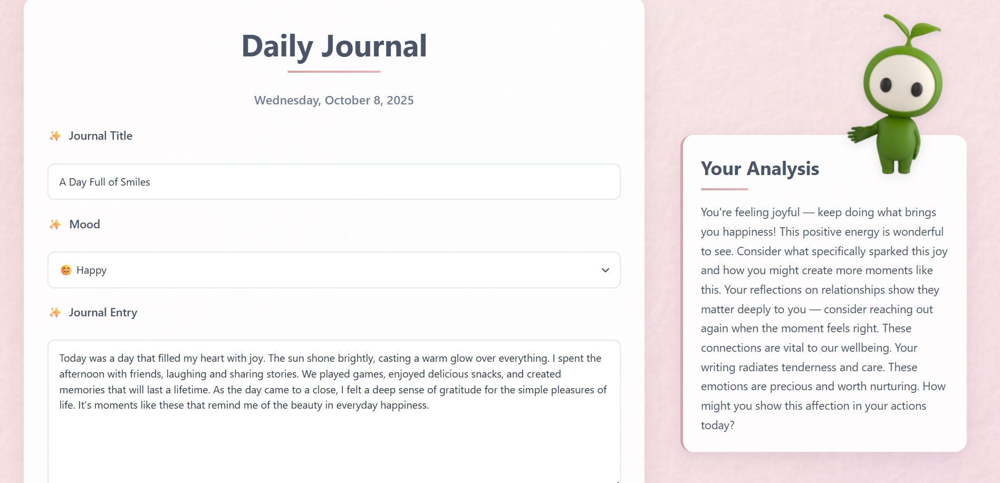
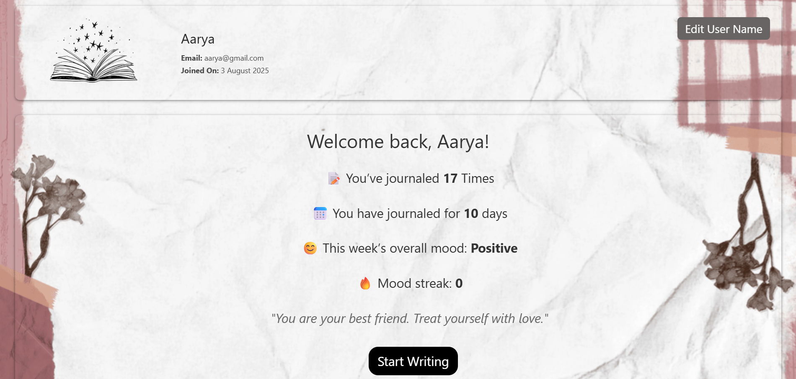
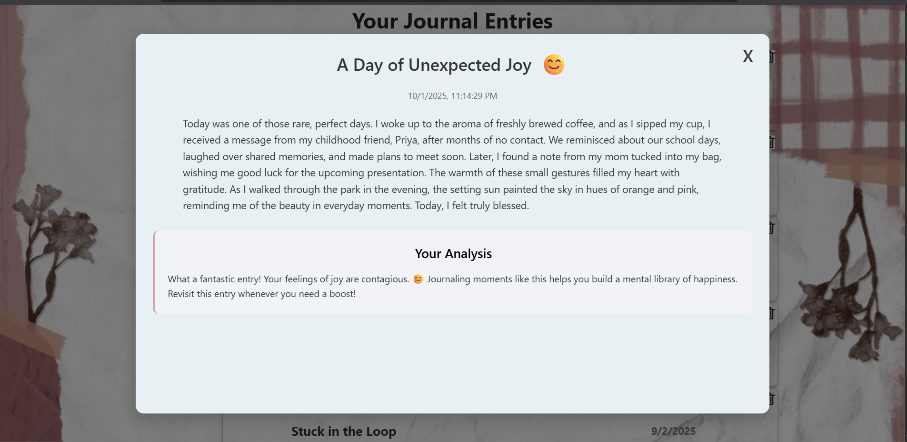
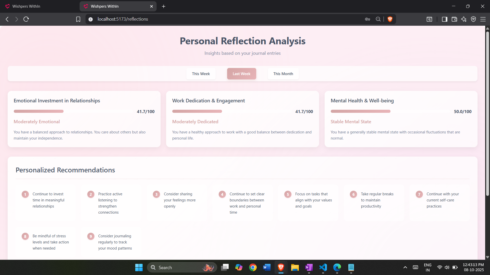
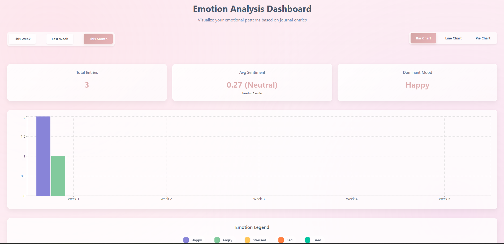

# 🌸 Whispers WithIn

A full-stack AI-powered digital journaling web app designed for self-reflection and emotional well-being. Users can create journal entries, track mood trends, view insights, and receive personalized reflections using sentiment analysis.

---

## 🚀 Features

- 📝 Digital Journal – Write freely in a secure, private space.
- 📊 Mood Tracking & Trends – Visualize emotional patterns over time (bar, line, pie charts).
- 📅 Reflection Calendar – See journaling activity and mood patterns at a glance.
- 🤖 AI-Powered Insights – Personalized reflections and emotional feedback using sentiment analysis (TextBlob).
- 🔐 Authentication – Secure login/signup with JWT + cookies.
- 📱 Responsive Design – Works seamlessly on mobile, tablet, and desktop.

---

## 🛠️ Tech Stack

**Frontend:** React, Axios, TailwindCSS, Vite  
**Backend:** Node.js, Express, MongoDB, JWT, Cookie Auth  
**AI / NLP:** TextBlob for sentiment analysis
**Deployment:** Vercel (frontend), Render (backend)

---

## 🖼️ Screenshots

### Homepage

### Journal

### Profile Page

### Saved Journals

### Mood Analysis

### Calender

### Emotion Analysis

---

## 🌐 Live Demo

**Frontend:** [Live on Vercel](https://project-journal-eight.vercel.app/)  
**Backend:** [Live on Render](https://project-journal-nrgb.onrender.com)

---

Made with ❤️ by Charu Tiwari
